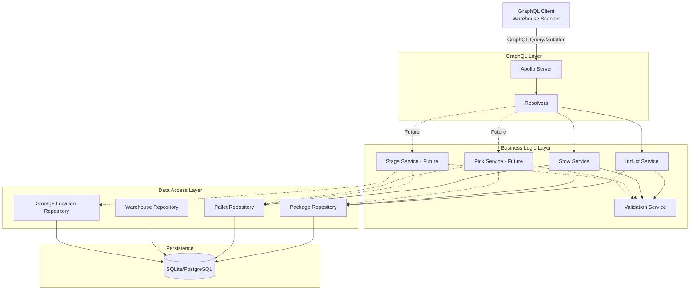
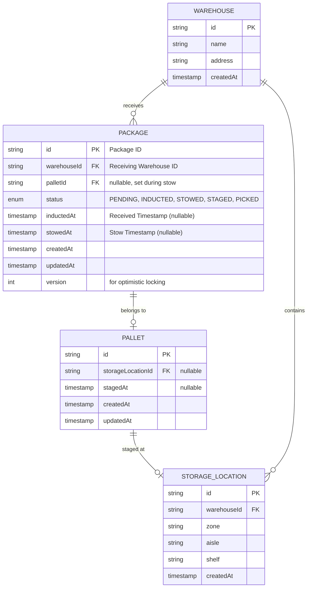
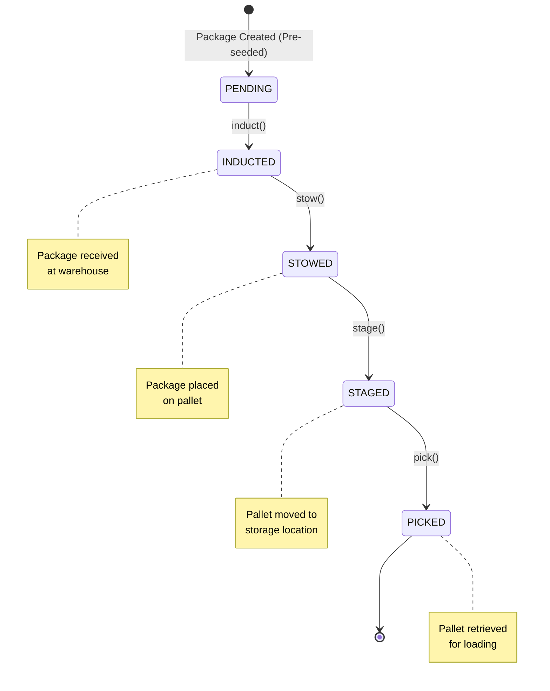

# WMS Technical Design Document

**Project:** Warehouse Management System (GraphQL API)  
**Author:** Thomas Markiewicz  
**Date:** December 10, 2025  
**Status:** Draft (Pending Clarification Call)

---

## Executive Summary

This document outlines the technical design for a Warehouse Management System (WMS) GraphQL API supporting package induction and stowing operations. The system manages state transitions for packages moving through a warehouse workflow: `PENDING → INDUCTED → STOWED → STAGED → PICKED`.

---

## 1. Open Questions (For Hiring Manager Call)

### 1.1 Idempotency & Duplicate Operations

**Question:** If a warehouse worker accidentally scans the same package twice within a short time window (e.g., 1 second), should the `induct` mutation:

- ✅ Return success both times (idempotent behavior)?
- ❌ Return an error on the second attempt ("Already inducted")?

**Rationale:** Barcode scanners may send duplicate requests due to accidental double-clicks or network retries. Understanding the desired behavior affects our validation logic.

---

### 1.2 State Transition Rules

**Question:** Are state transitions strictly linear, or can packages skip states?

- **Scenario A (Strict):** `PENDING → INDUCTED → STOWED → STAGED → PICKED` (no skipping)
- **Scenario B (Flexible):** A package could go `INDUCTED → STAGED` (bypassing `STOWED` for certain package types)

**Rationale:** Affects the state machine validation logic and whether we enforce strict ordering.

---

### 1.3 Re-Stowing Behavior

**Question:** If a package is already stowed on `PALLET_A`, and we attempt to stow it to `PALLET_B`, should the system:

- **Option 1:** Move the package (implicitly remove from `PALLET_A`, add to `PALLET_B`)?
- **Option 2:** Return a validation error ("Package already stowed on another pallet")?
- **Option 3:** Support an explicit "un-stow" operation first?

**Rationale:** Affects data model integrity and operational workflows.

---

### 1.4 Batch Operation Atomicity

**Question:** For batch mutations like `inductPackages([pkg1, pkg2, pkg3])`, if one package fails validation:

- **Option A (Atomic):** Roll back all 3 packages (all-or-nothing).
- **Option B (Partial Success):** Induct the 2 valid packages, return detailed errors for the failed one.

**Rationale:** High-throughput warehouses may prefer partial success to avoid blocking entire batches due to one bad scan.

---

### 1.5 Data Consistency vs. Throughput

**Question:** Should the system prioritize:

- **Strong Consistency:** Prevent all edge cases (e.g., concurrent stows) at the cost of throughput?
- **Eventual Consistency:** Accept temporary inconsistencies for higher scan rates, with background reconciliation?

**Rationale:** Affects choice of locking strategies (optimistic vs. pessimistic) and database design.

---

### 1.6 Staging/Storage Location Requirements

**Question:** When staging a pallet to a storage location, what information is required?

- **Option A (Full Location):** Warehouse workers must provide all location details (warehouse, zone, aisle, shelf)?
- **Option B (Location ID):** Workers scan a pre-existing location barcode (e.g., `LOC-A5-B3`)?
- **Option C (Flexible):** Allow partial information (just aisle, or just zone)?

**Follow-up:** Should the system validate that:

- The storage location exists?
- The storage location isn't already occupied?
- The storage location is in the correct warehouse?

**Rationale:** Affects the `stage` mutation signature and validation logic. Also determines if we need a `StorageLocation` seed data or if locations are created dynamically.

---

### 1.7 Picking Granularity

**Question:** Does the pick operation work at the pallet level or package level?

- **Option A (Pallet-Level Picking):** The entire pallet is picked and loaded onto a truck. All packages on that pallet transition to `PICKED` state.

  - Simpler logic
  - Faster warehouse operations
  - Assumes orders are built by pallet

- **Option B (Package-Level Picking):** Workers can pick individual packages from a pallet.
  - A pallet might have some packages `PICKED` and others still `STOWED`
  - Remaining packages stay on the pallet (which may need re-staging)
  - More flexible for order fulfillment
  - More complex state management

**Follow-up questions if Option B:**

- Can a pallet be in a mixed state (some packages picked, some not)?
- Does picking a package require a `pick` mutation per package, or batch?
- What happens to the pallet when all its packages are picked?
- Should there be a `RE_STAGED` status for pallets that have been partially picked?

**Rationale:** Fundamentally changes the data model and picking workflow. Affects whether `PICKED` is a package state or a pallet state.

---

### 1.8 Failed Delivery / Returns Handling

**Question:** What happens when packages fail delivery and return to the warehouse?

- **Option A (New State):** Add a `RETURNED` or `FAILED_DELIVERY` state after `PICKED`

  - Package came back, needs disposition decision
  - May need a `returnReason` field

- **Option B (State Reversal):** Package transitions back to an earlier state

  - `PICKED` → `INDUCTED` (re-enter the workflow)
  - Attempt counter increments

- **Option C (Out of Scope):** Failed deliveries are handled by a separate returns system
  - Not part of the WMS workflow
  - Different database/service

**Follow-up questions:**

- Should we track delivery attempt count?
- Can a package be picked multiple times?
- Is there a maximum retry limit before the package is marked for return-to-sender?
- Do returned packages need special handling (inspection, re-labeling)?

**Rationale:** Veho uses private drivers, so failed deliveries are common. The system needs to handle the reverse flow gracefully. This significantly affects the state machine design - it may not be strictly linear.

---

## 2. Implementation Assumptions (Pending Clarification)

For the initial implementation, the following assumptions have been made. These decisions are documented and can be easily adjusted based on feedback from the clarification call:

| Assumption              | Decision                                | Rationale                                                                              |
| ----------------------- | --------------------------------------- | -------------------------------------------------------------------------------------- |
| **Idempotency**         | All mutations are idempotent            | Industry best practice; prevents duplicate operations from scanner double-clicks       |
| **State Transitions**   | Strictly linear (no skipping)           | Simpler to implement and reason about; can be relaxed later if needed                  |
| **Batch Operations**    | Partial success model                   | More practical for high-throughput warehouses; one bad scan doesn't block entire batch |
| **Picking Granularity** | Whole-pallet picking                    | Matches prompt wording ("retrieve pallets"); simpler data model                        |
| **Storage Locations**   | Pre-existing locations (scan barcode)   | Realistic warehouse workflow; workers scan location labels                             |
| **Re-stowing**          | Not allowed (validation error)          | Prevents accidental moves; can add explicit "move" mutation if needed                  |
| **Failed Deliveries**   | Out of scope for initial implementation | Can be added as future enhancement with new state or reverse transition                |
| **Concurrency Control** | Optimistic locking with version field   | Balances consistency with throughput; prevents race conditions                         |

**Note:** These assumptions are explicitly called out in Architecture Decision Records (ADRs) below and can be modified based on business requirements clarified during the hiring manager call.

---

## 3. Architecture Overview

**Per PROMPT.md Requirements:** This architecture illustrates data flow and system components for:

- ✅ **Induct** (registering newly arrived packages) - _Implemented_
- ✅ **Stow** (placing packages onto pallets) - _Implemented_
- ⏸️ **Stage** (placing pallets into storage locations) - _Design only_
- ⏸️ **Pick** (retrieving pallets from storage) - _Design only_



---

## 3. Data Model

**PROMPT.md Field Mapping:**

- **Induct Requirements:**
  - ✅ Package ID → `PACKAGE.id`
  - ✅ Receiving Warehouse ID → `PACKAGE.warehouseId`
  - ✅ Received Timestamp → `PACKAGE.inductedAt`
- **Stow Requirements:**
  - ✅ Pallet ID → `PALLET.id`
  - ✅ Stow Timestamp → `PACKAGE.stowedAt`
  - ✅ Package IDs → `PACKAGE.palletId` (foreign key association)



### Key Relationships

- **Package → Warehouse:** Many-to-One (Packages are inducted at a specific warehouse)
- **Package → Pallet:** Many-to-One (Multiple packages can be on one pallet)
- **Pallet → Storage Location:** One-to-One (A pallet is staged at one location)

---

## 4. State Transitions

**Per PROMPT.md:** "State transitions: INDUCTED → STOWED → STAGED → PICKED"

**Implementation Note:** We added a `PENDING` state at the beginning to represent packages that have been created in the system but not yet received at the warehouse. This aligns with the prompt's note that "packages already exist in our database by the time they're inducted."



### Validation Rules (Based on Implementation Assumptions)

1. **Induct:** Package must be in `PENDING` state. If already `INDUCTED`, operation is idempotent (returns success).
2. **Stow:** Package must be in `INDUCTED` state. Cannot re-stow to a different pallet (validation error).
3. **Stage:** Pallet must have at least one `STOWED` package. Storage location must exist.
4. **Pick:** Entire pallet is picked (all packages transition to `PICKED` state).

---

## 5. Architecture Decisions

### ADR-001: Idempotency Strategy

**Status:** ACCEPTED (Subject to clarification feedback)

**Context:** Warehouse scanners may send duplicate requests due to network retries or user error.

**Decision:** Implement idempotent mutations. Calling `induct("PKG123")` twice returns success if the package is already in the target state.

**Consequences:**

- ✅ Better UX for warehouse workers (no confusing errors on double-scans)
- ✅ Resilient to network retries
- ⚠️ Requires clear logging to distinguish "new induct" vs "duplicate induct"

---

### ADR-002: Batch Mutation Behavior

**Status:** ACCEPTED (Subject to clarification feedback)

**Context:** Workers may scan multiple packages in rapid succession. One invalid package shouldn't block the entire batch.

**Decision:** Implement partial success for batch operations. Return a structured response with per-package results.

**Example Response:**

```graphql
{
  "data": {
    "inductPackages": {
      "successCount": 2,
      "failureCount": 1,
      "results": [
        { "packageId": "PKG001", "success": true, "message": "Inducted successfully" },
        { "packageId": "PKG002", "success": true, "message": "Inducted successfully" },
        { "packageId": "PKG003", "success": false, "message": "Package not found" }
      ]
    }
  }
}
```

**Consequences:**

- ✅ High throughput (no transaction rollbacks)
- ✅ Clear error reporting per package
- ⚠️ Requires careful client-side error handling

---

### ADR-003: Concurrency Control

**Status:** ACCEPTED (Subject to clarification feedback)

**Context:** Two workers might attempt to stow the same package to different pallets simultaneously.

**Decision:** Use optimistic locking with a `version` field on the `Package` table.

**Implementation:**

```sql
UPDATE packages
SET pallet_id = 'PALLET_B', version = version + 1, status = 'STOWED'
WHERE id = 'PKG123' AND version = 5;
```

If the `version` has changed (another worker updated it), the query affects 0 rows, and we return a conflict error.

**Consequences:**

- ✅ Prevents race conditions without blocking reads
- ✅ Scales well under high concurrency
- ⚠️ Client must implement retry logic on conflict

---

### ADR-004: Error Handling Pattern

**Status:** APPROVED

**Decision:** Use a Result pattern for all mutations.

**GraphQL Schema:**

```graphql
type InductResult {
  success: Boolean!
  message: String!
  package: Package
  errors: [ValidationError!]
}

type ValidationError {
  field: String!
  message: String!
  code: ErrorCode!
}

enum ErrorCode {
  NOT_FOUND
  INVALID_STATE
  ALREADY_EXISTS
  VALIDATION_FAILED
}
```

**Rationale:**

- GraphQL doesn't have HTTP status codes.
- Throwing exceptions pollutes the `errors` array (meant for system errors).
- A Result type provides structured, programmatic error handling.

---

## 6. GraphQL Schema (Draft)

**Note:** Per the prompt requirements:

- Packages are pre-seeded in the database with `PENDING` status (clients send package data in advance)
- The `induct` mutation updates existing packages from `PENDING` to `INDUCTED`
- The `stow` mutation updates packages from `INDUCTED` to `STOWED` and associates them with a pallet

```graphql
# ============================================
# Types
# ============================================

enum PackageStatus {
  PENDING
  INDUCTED
  STOWED
  STAGED
  PICKED
}

type Package {
  id: ID!
  warehouseId: ID!
  palletId: ID
  status: PackageStatus!
  inductedAt: DateTime
  stowedAt: DateTime
  createdAt: DateTime!
  updatedAt: DateTime!
}

type Pallet {
  id: ID!
  storageLocationId: ID
  packages: [Package!]!
  stagedAt: DateTime
  createdAt: DateTime!
  updatedAt: DateTime!
}

type Warehouse {
  id: ID!
  name: String!
  address: String
}

# ============================================
# Mutations
# ============================================

type Mutation {
  """
  Induct a single package into the warehouse.
  Updates package status from PENDING to INDUCTED.
  Required fields match PROMPT.md:
  - Package ID (uniquely identifies a package)
  - Receiving Warehouse ID (uniquely identifies the induct facility)
  - Received Timestamp (when the package was received)
  """
  inductPackage(
    packageId: ID!
    warehouseId: ID!
    receivedAt: DateTime
  ): InductResult!

  """
  Induct multiple packages in a batch operation.
  Returns partial success if some packages fail validation.
  """
  inductPackages(packages: [InductPackageInput!]!): InductBatchResult!

  """
  Stow packages onto a pallet.
  Updates package status from INDUCTED to STOWED.
  Required fields match PROMPT.md:
  - Pallet ID (a unique identifier for the pallet)
  - Package IDs (a list of Package IDs to stow)
  - Stow Timestamp (when the packages were stowed onto the pallet)
  """
  stowPackages(
    palletId: ID!
    packageIds: [ID!]!
    stowedAt: DateTime
  ): StowResult!
}

# ============================================
# Inputs
# ============================================

input InductPackageInput {
  packageId: ID!
  warehouseId: ID!
  receivedAt: DateTime
}

# ============================================
# Results
# ============================================

type InductResult {
  success: Boolean!
  message: String!
  package: Package
  errors: [ValidationError!]
}

type InductBatchResult {
  successCount: Int!
  failureCount: Int!
  results: [InductResult!]!
}

type StowResult {
  success: Boolean!
  message: String!
  pallet: Pallet
  errors: [ValidationError!]
}

type ValidationError {
  field: String!
  message: String!
  code: ErrorCode!
}

enum ErrorCode {
  NOT_FOUND
  INVALID_STATE
  ALREADY_EXISTS
  VALIDATION_FAILED
  CONFLICT
}

# ============================================
# Queries
# ============================================

type Query {
  """
  Get a package by ID.
  """
  package(id: ID!): Package

  """
  Get a pallet by ID, including all associated packages.
  """
  pallet(id: ID!): Pallet

  """
  Get all packages for a warehouse, optionally filtered by status.
  """
  packages(
    warehouseId: ID!
    status: PackageStatus
    limit: Int = 50
    offset: Int = 0
  ): [Package!]!
}
```

---

## 7. Validation Logic

### 7.1 Induct Validation

**Per PROMPT.md:** "Clients send Veho package data in advance to inform us which packages they plan to inject into our network. In the ideal scenario, those packages already exist in our database by the time they're inducted, so your system should only need to update their status."

```typescript
async validateInduct(packageId: string, warehouseId: string): ValidationResult {
  // 1. Check if package exists (should be pre-seeded with PENDING status)
  const pkg = await packageRepo.findById(packageId);
  if (!pkg) {
    return { valid: false, code: 'NOT_FOUND', message: 'Package not found' };
  }

  // 2. Check if warehouse exists
  const warehouse = await warehouseRepo.findById(warehouseId);
  if (!warehouse) {
    return { valid: false, code: 'NOT_FOUND', message: 'Warehouse not found' };
  }

  // 3. Check state transition (PENDING → INDUCTED)
  if (pkg.status === 'INDUCTED') {
    // Idempotent: Already inducted, return success
    return { valid: true, idempotent: true };
  }

  if (pkg.status !== 'PENDING') {
    return {
      valid: false,
      code: 'INVALID_STATE',
      message: `Cannot induct package in ${pkg.status} state`
    };
  }

  return { valid: true };
}
```

### 7.2 Stow Validation

```typescript
async validateStow(packageIds: string[], palletId: string): ValidationResult {
  // 1. Check if pallet exists (or create if doesn't exist)
  let pallet = await palletRepo.findById(palletId);
  if (!pallet) {
    pallet = await palletRepo.create({ id: palletId });
  }

  // 2. Validate each package
  for (const pkgId of packageIds) {
    const pkg = await packageRepo.findById(pkgId);

    if (!pkg) {
      return { valid: false, code: 'NOT_FOUND', message: `Package ${pkgId} not found` };
    }

    // Check state (must be INDUCTED to be stowed)
    if (pkg.status === 'STOWED' && pkg.palletId === palletId) {
      // Idempotent: Already stowed on this pallet
      continue;
    }

    if (pkg.status !== 'INDUCTED') {
      return {
        valid: false,
        code: 'INVALID_STATE',
        message: `Package ${pkgId} is in ${pkg.status} state, expected INDUCTED`
      };
    }

    // Check if already on a different pallet (PENDING CLARIFICATION)
    if (pkg.palletId && pkg.palletId !== palletId) {
      return {
        valid: false,
        code: 'CONFLICT',
        message: `Package ${pkgId} already stowed on pallet ${pkg.palletId}`
      };
    }
  }

  return { valid: true };
}
```

---

## 8. Testing Strategy

### 8.1 Unit Tests (Priority 1)

Focus on business logic and validation:

```typescript
describe('InductService', () => {
  test('should induct a PENDING package successfully', async () => {
    // Given: A package in PENDING state
    // When: induct() is called
    // Then: Package status should be INDUCTED, inductedAt should be set
  });

  test('should be idempotent for already INDUCTED packages', async () => {
    // Given: A package already INDUCTED
    // When: induct() is called again
    // Then: Should return success without error
  });

  test('should reject inducting a STOWED package', async () => {
    // Given: A package in STOWED state
    // When: induct() is called
    // Then: Should return INVALID_STATE error
  });

  test('should reject inducting non-existent package', async () => {
    // Given: An invalid packageId
    // When: induct() is called
    // Then: Should return NOT_FOUND error
  });
});

describe('StowService', () => {
  test('should stow INDUCTED packages successfully', async () => {
    // Given: Multiple packages in INDUCTED state
    // When: stow() is called
    // Then: All packages should be STOWED on the pallet
  });

  test('should reject stowing a package already on another pallet', async () => {
    // Given: A package stowed on PALLET_A
    // When: Attempting to stow on PALLET_B
    // Then: Should return CONFLICT error (pending clarification)
  });

  test('should handle partial batch failures gracefully', async () => {
    // Given: A mix of valid and invalid packages
    // When: stowPackages() is called
    // Then: Should return partial success with detailed errors
  });
});
```

### 8.2 Integration Tests (Priority 2)

Test GraphQL resolvers with in-memory database:

```typescript
describe('GraphQL Mutations', () => {
  test('inductPackage mutation', async () => {
    const mutation = `
      mutation {
        inductPackage(packageId: "PKG001", warehouseId: "WH001") {
          success
          message
          package { id status }
        }
      }
    `;
    // Assert response structure and database changes
  });
});
```

### 8.3 E2E Tests (Priority 3)

Full workflow tests:

```typescript
test('Complete workflow: Induct → Stow → Query', async () => {
  // 1. Induct a package
  // 2. Stow it on a pallet
  // 3. Query the pallet to verify packages are associated
});
```

---

## 9. Future Enhancements

### 9.1 Event Sourcing

Capture all state transitions as immutable events:

```typescript
interface PackageEvent {
  id: string;
  packageId: string;
  eventType: 'INDUCTED' | 'STOWED' | 'STAGED' | 'PICKED';
  timestamp: Date;
  userId: string; // Operator who performed the action
  metadata: Record<string, any>;
}
```

**Benefits:**

- Full audit trail ("Who inducted this package at 2:34 PM?")
- Ability to replay state changes for debugging
- Analytics on warehouse performance

---

### 9.2 Real-Time Subscriptions

Allow clients to subscribe to package state changes:

```graphql
type Subscription {
  packageUpdated(warehouseId: ID!): Package!
}
```

**Use Case:** Dashboard showing live package flow through the warehouse.

---

### 9.3 Distributed Tracing

Add OpenTelemetry spans for observability:

```typescript
const span = tracer.startSpan('induct_package');
span.setAttribute('package.id', packageId);
span.setAttribute('warehouse.id', warehouseId);
// ... perform induction ...
span.end();
```

**Benefits:**

- Debug slow mutations in production
- Correlate errors across services

---

### 9.4 Rate Limiting & Throttling

Protect against runaway scanners:

```typescript
@RateLimit({ max: 100, window: '1m' })
async inductPackage(packageId: string) { ... }
```

---

### 9.5 Multi-Warehouse Orchestration

If packages move between warehouses:

- Add `transferPackage(packageId, fromWarehouseId, toWarehouseId)` mutation
- Track package lineage across facilities

---

## 10. Technology Stack

| Layer              | Technology                       | Rationale                                                     |
| ------------------ | -------------------------------- | ------------------------------------------------------------- |
| **Runtime**        | Node.js 20+                      | Required by prompt, mature ecosystem                          |
| **Language**       | TypeScript 5+                    | Type safety, required by prompt                               |
| **GraphQL Server** | Apollo Server 4                  | Industry standard, excellent DX                               |
| **Database**       | SQLite (dev) / PostgreSQL (prod) | SQLite for simplicity, Postgres for production-ready features |
| **ORM**            | Prisma                           | Type-safe queries, excellent TypeScript integration           |
| **Testing**        | Jest + ts-jest                   | Standard for Node/TS projects                                 |
| **Validation**     | Zod                              | Runtime type validation for inputs                            |
| **Linting**        | ESLint + Prettier                | Code quality consistency                                      |

---

## 11. Project Structure

```
veho-wms/
├── src/
│   ├── schema/
│   │   ├── schema.graphql          # GraphQL type definitions
│   │   └── resolvers.ts            # Root resolvers
│   ├── services/
│   │   ├── induct.service.ts       # Induct business logic
│   │   ├── stow.service.ts         # Stow business logic
│   │   └── validation.service.ts   # Shared validation
│   ├── repositories/
│   │   ├── package.repository.ts   # Package data access
│   │   ├── pallet.repository.ts    # Pallet data access
│   │   └── warehouse.repository.ts # Warehouse data access
│   ├── models/
│   │   └── types.ts                # Shared TypeScript types
│   ├── database/
│   │   ├── schema.prisma           # Prisma schema
│   │   └── seed.ts                 # Pre-seed sample data
│   └── server.ts                   # Apollo Server setup
├── tests/
│   ├── unit/
│   │   ├── induct.service.test.ts
│   │   └── stow.service.test.ts
│   └── integration/
│       └── resolvers.test.ts
├── docs/
│   ├── DESIGN.md                   # This document
│   └── architecture.png            # Architecture diagram
├── package.json
├── tsconfig.json
├── jest.config.js
└── README.md
```

---

## 12. Deliverable Checklist (Per PROMPT.md)

### Required Deliverables

- [ ] **Complete GraphQL API for induct and stow**
  - [ ] Induct mutation (single package)
  - [ ] Induct mutation (batch packages)
  - [ ] Stow mutation (packages to pallet)
  - [ ] Proper validation (state checks, existence checks, edge cases)
  - [ ] Structured responses (success/failure with messages)
- [ ] **Architecture diagram** (PDF/image)
  - [ ] Shows data flow for Induct, Stow, Stage, Pick
  - [ ] GraphQL server, resolvers, services, data access layers
  - [ ] Data model relationships (pallets, packages, storage locations)
  - [ ] State transitions: INDUCTED → STOWED → STAGED → PICKED
  - [ ] Future enhancements
- [ ] **README with:**
  - [ ] Setup instructions
  - [ ] Example GraphQL queries/mutations
  - [ ] How to run tests
- [ ] **Tests**
  - [ ] Unit tests for core logic (validation, state handling, mutation behavior)
  - [ ] Integration tests (optional but recommended)

### Technical Requirements

- [x] TypeScript and Node.js
- [x] GraphQL schema, resolvers, and services are modular and testable
- [x] Persistent database (PostgreSQL)
- [x] Packages pre-seeded with PENDING status
- [x] Package-pallet association in data model

---

## 13. Implementation Phases

### Phase 1: Foundation (Day 1)

- [x] Create project structure
- [ ] Setup TypeScript + Apollo Server
- [ ] Define Prisma schema
- [ ] Seed database with sample packages (PENDING status) and warehouses

### Phase 2: Core Features (Day 2)

- [ ] Implement `inductPackage` mutation
- [ ] Implement `stowPackages` mutation
- [ ] Add basic validation logic
- [ ] Unit tests for services

### Phase 3: Polish (Day 3)

- [ ] Add batch mutations (`inductPackages`)
- [ ] Implement Result pattern
- [ ] Add integration tests
- [ ] Create architecture diagram

### Phase 4: Documentation (Day 4)

- [ ] Complete README with setup instructions
- [ ] Add example GraphQL queries
- [ ] Document API in schema comments
- [ ] Export architecture diagram as PNG/PDF
- [ ] Final review & submission

---

## 14. Risk Assessment

| Risk                                      | Probability | Impact | Mitigation                                          |
| ----------------------------------------- | ----------- | ------ | --------------------------------------------------- |
| Misunderstanding business requirements    | Medium      | High   | Schedule clarification call with Abrar              |
| Time constraint (2 days before interview) | High        | Medium | Focus on core features, defer "nice-to-haves"       |
| Concurrency bugs                          | Low         | High   | Implement optimistic locking, add concurrency tests |
| Over-engineering                          | Medium      | Medium | Follow YAGNI principle, prioritize requirements     |

---

## Appendix A: Glossary

| Term                   | Definition                                                                                                |
| ---------------------- | --------------------------------------------------------------------------------------------------------- |
| **Induct**             | The process of receiving and registering a package into the warehouse system                              |
| **Stow**               | Placing packages onto a pallet for storage                                                                |
| **Stage**              | Moving a pallet to a designated storage location in the warehouse                                         |
| **Pick**               | Retrieving a pallet from storage for loading onto a truck                                                 |
| **Idempotency**        | A property where performing an operation multiple times has the same effect as performing it once         |
| **Optimistic Locking** | A concurrency control method that assumes conflicts are rare and checks for conflicts only at commit time |

---

## Appendix B: References

- [GraphQL Best Practices](https://graphql.org/learn/best-practices/)
- [Apollo Server Documentation](https://www.apollographql.com/docs/apollo-server/)
- [Prisma Schema Reference](https://www.prisma.io/docs/reference/api-reference/prisma-schema-reference)
- [Martin Fowler - Event Sourcing](https://martinfowler.com/eaaDev/EventSourcing.html)

---

**Document Status:** DRAFT - Awaiting clarification call with Abrar (Hiring Manager)

**Next Actions:**

1. Schedule clarification call with recruiter
2. Begin Phase 1 implementation after call
3. Update this document with confirmed requirements
